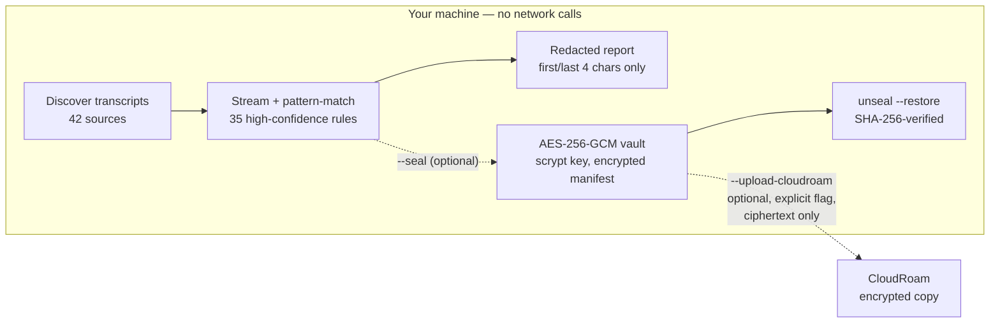

<div align="center">

<picture>
  <source media="(prefers-color-scheme: dark)" srcset="docs/logo-dark.svg">
  <source media="(prefers-color-scheme: light)" srcset="docs/logo-light.svg">
  
</picture>

**Find secrets leaking through your AI coding agent's session history.**

[](https://www.npmjs.com/package/residoo)
[](https://github.com/dandovdub/residoo/actions/workflows/ci.yml)
[](LICENSE)
[](package.json)
[](package.json)


</div>

Every time Claude Code, Cursor, or a similar tool reads a file, runs a command, or
browses a page on your behalf, it writes a transcript of the whole session to disk —
including the contents of whatever it touched. If that ever included a `.env` file,
a config with a real key in it, or a login token captured during testing, that
credential is now sitting in plaintext, indefinitely, in a place almost nobody
thinks to check.

residoo scans those transcripts and tells you what's in them.

```
$ residoo scan

⚠  17 potential secrets found across 3 files
   87 files scanned (1.2 GB) · sources: claude-code
   oldest match ~8d old · most recent ~0d old

    16  [high]  AWS Access Key ID   (1 distinct value, re-exposed 15× across tool output)
     1  [high]  Private key block

Values are redacted in this report — first/last 4 characters only. Nothing scanned
here left your machine; residoo makes no network calls.
```

## Why this, and not a git secret scanner

Tools like `gitleaks` and `trufflehog` are excellent at what they do — and what
they do is scan **commits**. That's a different, well-covered space. Nobody was
looking at the **conversation transcripts** these agents leave behind, which
contain a superset of everything a commit does: not just code, but file
contents, terminal output, and whatever got pasted into a prompt.

Two newer categories are adjacent but solve a different problem, worth being
precise about rather than lumping together:

- **Real-time hooks** (e.g. GitGuardian's `ggshield` AI hook, GitHub's secret
  scanning via its MCP server) intercept a prompt or a code change *as it
  happens*, going forward, in the session that has the hook installed. They
  do nothing for the months of transcripts already sitting on disk, or for
  any session run without the hook active. residoo scans **retroactively, at
  rest** — every file already there, from every past session.
- **agentsweep** is a genuine, welcome peer covering similar ground — broader,
  in fact: 31 agent sources and 209 detection rules to residoo's smaller set,
  plus in-place redaction, SARIF output, and a pre-commit hook. Worth naming
  the tradeoffs precisely rather than either dismissing it or copying it
  blindly: it needs Python 3.11+ and three pip packages (all clean ones, on
  inspection — no known CVEs), where residoo needs nothing beyond Node. Its
  own README documents that its in-place redaction leaves the pre-redaction
  original sitting in a **plaintext** `.bak` file, and its issue tracker shows
  the real cost of that design: a merged fix
  ([PR #13](https://github.com/Ishannaik/agent-sweep/pull/13)) for a case
  where redacting a WAL-mode SQLite database left the secret recoverable from
  a leftover journal file. residoo's `--seal` takes a different tradeoff —
  encrypt a copy, touch nothing, never claim a file is "cleaned" — precisely
  to avoid that failure class. Its tracker also shows several real,
  since-fixed false-*clean* reports (schema drift and malformed lines
  silently skipped, `--root` pointed at a file scanning nothing and exiting
  0) — the exact failure mode residoo's `broken`/`partial` status contract
  (see `CONTRIBUTING.md`) exists to make structurally hard to reproduce. None
  of this makes agentsweep bad; it makes for a legitimately different set of
  choices, and its README is honest about its own tradeoffs too — worth a
  look if broader source coverage matters more to you than a minimal
  dependency footprint.

This isn't a gap Anthropic is planning to close upstream, either: a
[request to scrub secrets from `~/.claude/projects` natively](https://github.com/anthropics/claude-code/issues/50014)
was filed and closed as **not planned**. Whatever scans this directory, it
won't be built into the tool that writes it.

## What it does

- Scans your local AI-agent session transcripts for high-confidence secret
  patterns (cloud provider keys, private key blocks, OAuth/API tokens,
  database connection strings, and more — see `src/patterns.js`).
- Redacts everything in its own output. You get a shape and a first/last-4
  preview, never the real value — including in `--json` mode.
- Tells you how many **distinct** secrets it found versus how many times one
  got echoed back across tool calls, so the headline number reflects real
  exposure, not repetition.
- Flags likely placeholder/example matches (an HTML form's
  `placeholder="AKIA..."` hint, a doc's example key) separately from real
  findings, rather than either hiding them or inflating the count with them.

## How it works



The dotted legs never run unless you pass their flag.

## Sealing what it finds

Finding a leaked key in a transcript raises the obvious next question: *now
what?* `--seal` is the answer:

```bash
residoo scan --seal
```

Every transcript that carried a finding is encrypted into a local vault
directory — AES-256-GCM, key derived from your passphrase with scrypt, streamed
(an 800MB transcript never touches memory whole). The vault's manifest — the
mapping from numbered blobs back to real paths — is itself encrypted, so the
vault doesn't advertise what's inside it even by name. **Originals are never
touched**: once you've verified a restore works (`residoo unseal <vault> --restore
0001.sealed --out /tmp/check` — verified byte-identical via a recorded SHA-256),
deleting the plaintext is your decision, made by you, not by this tool.

Optionally, `--upload-cloudroam` (with `CLOUDROAM_API_KEY`, `--connector`,
`--bucket`) copies the sealed vault to [CloudRoam](https://cloudroam.io) for
durable, cross-cloud storage. **This is the only feature in residoo that touches
the network, it never runs unless you pass the flag, and only ciphertext is
transmitted** — the vault is sealed before upload code ever executes.

## What it does not do

- **No network calls in the default path — and none at all unless you
  explicitly pass `--upload-cloudroam`.** A secret scanner that phones home is
  not a tool you should trust with your secrets. Verify this yourself: the one
  `fetch` call in the codebase is in `src/sealvault.js`, reachable only behind
  that flag, and sends only encrypted bytes.
- **Nothing destructive, ever.** Scanning is read-only. Sealing creates *new*
  files and modifies or deletes nothing — not even the plaintext it just
  encrypted a copy of. That last step is deliberately left to a human.
- **No telemetry, no analytics, no update-check ping.**

## Install

```bash
npx residoo scan
```

or install it properly:

```bash
npm install -g residoo
residoo scan
```

Requires Node.js 18+ (the SQLite-backed sources listed above additionally
need 22.5+; residoo still runs and scans every line-delimited/JSON source,
including Claude Code, fine without it). Zero runtime dependencies — check
`package.json`.

## Usage

```
residoo scan [options]

  --json                  machine-readable output (full detail, still redacted)
  --include-noisy         also run broad, false-positive-prone rules
  --include-suppressed    also show matches that looked like placeholder/example text
  --fail-on-find          exit code 1 if anything is found (for CI)
  --no-color              disable ANSI colour

  --seal                  encrypt every transcript with findings into a local vault
  --vault-dir <dir>       vault location (default ./residoo-vault-<stamp>)
  --upload-cloudroam      also upload the sealed vault (needs CLOUDROAM_API_KEY,
                          --connector <id>, --bucket <name>; ciphertext only)

residoo unseal <vault-dir>                          list a vault's contents
residoo unseal <vault-dir> --restore <n> --out <p>  restore one file, hash-verified
```

The vault passphrase comes from `RESIDOO_PASSPHRASE` or a hidden interactive
prompt. There is no recovery if you lose it — that is the point of the design,
so pick one you keep.

## Sources supported today

42 sources as of this writing, in two honestly-distinct tiers — see
`src/sources/index.js` for the full list and grouping, and each source file's
own header for exactly what was and wasn't checked.

**Real-install-verified** — the adapter was run against an actual, populated
installation and confirmed to find real transcript content:

- **Claude Code** (`~/.claude/projects/**/*.jsonl`)

**Multi-source-corroborated-but-unverified** — the path/schema is backed by
2+ independent, credible sources (official docs, the tool's own shipped
source code, a real community tool that reads the same files for a living,
or a real user's own reported install) but was **not** checked against a real
install of the tool on any machine this project was built on. Every adapter
in this tier is still built to fail loudly (`broken: true`, `status:
"failed"`) rather than silently report "all clear" — but the path itself
could still be stale or wrong in a way only a real install can catch. If you
use one of these and can confirm `residoo scan`'s file counts look right for
what's actually on your disk, that report is exactly what moves a source out
of this tier:

Cursor, Codex CLI, OpenCode, Aider, Cline, Roo Code, Kilo Code, Windsurf,
PearAI, Trae, Void, Gemini CLI, Qwen Code, Continue, Open Interpreter, Goose,
GitHub Copilot Chat, GitHub Copilot CLI, `llm` (Simon Willison's Datasette-
adjacent CLI), Codebuff, Mentat, Hermes, OpenClaw, Warp, Crush, Grok Build,
Kiro CLI, Kiro IDE, Zed, JetBrains Junie, JetBrains AI Assistant, Sourcegraph
Cody, Amazon Q Developer, Qodo Gen, OpenHands, Factory Droid CLI, Devin CLI,
Pi, Google Antigravity, Kimi Code, and `fx`.

A few of these are SQLite-backed (Cursor, Crush, Cody, Devin CLI, Hermes,
Kiro CLI, `llm`, Trae, Void, Warp, Zed) and need Node.js 22.5+ for the
built-in `node:sqlite` module (not a dependency — see `package.json`); on an
older Node, `residoo scan` reports each of those as detected-but-not-scanned
rather than silently dropping it or crashing.

**Investigated and deliberately not included**, rather than guessed at:
Plandex (confirmed, from its own source, to be client-server with nothing
local to scan), CodeGPT and Augment Code (both account/cloud-based, no
evidence of a local transcript file), and Replit Agent (confirmed
cloud-only). Tabby, Tabnine, Zencoder, Tongyi Lingma, and Berd were
researched but didn't clear this project's 2-independent-source bar in the
time available — a verified adapter for any of these is a welcome PR.

## Adding a source

A source is a small object with four methods: `id()`, `label()`,
`available()`, `files()`, and `readLines(file)`. `src/sources/claude-code.js`
is the reference implementation — copy it, point it at the real local
storage path for your tool, and open a PR. Two contracts scan.js actually
depends on, worth getting right rather than guessing from a quick skim:

- **`files()`** is a generator yielding `{ file, mtimeMs, sizeBytes, broken }`.
  Set `broken: true` (other fields can be omitted) for an entry that looked
  like it should be scannable but wasn't — a dangling symlink is the main
  case. Don't just `continue` past it inside the generator: an early version
  of the Claude Code source did exactly that, and a real, non-hypothetical
  case (a project directory relocated via a symlink whose target no longer
  exists) went completely invisible — not in the scan count, not in any
  warning, nothing. Surfacing it as `broken` is what lets scan.js report it
  instead.
- **`readLines(file)`** is `async`, returning `{ lines, status, bytesRead }`.
  `status` is `"complete"`, `"partial"` (some real lines WERE read before a
  failure partway through — return them, don't discard real content because
  the rest of the file didn't finish cleanly), `"too-large"`, or `"failed"`.
  Whatever you return in `lines` for a non-"complete" status still gets
  scanned normally.

Please verify the path actually exists and holds real content before
submitting — see the note above on why
that matters here specifically.

## A known limitation, stated plainly

Shape-based detection can't tell a real secret from a realistic-looking
example in a fetched web page or a piece of documentation your agent read
aloud back to you. The `--include-suppressed`/placeholder-context heuristic
catches the common UI-hint case, not every case. Treat every finding as a
lead to check, not a certainty — the same is true of every tool in this
category, including the well-established ones.

## License

MIT. See `LICENSE`.

---

Built and maintained by the team behind [CloudRoam](https://cloudroam.io) —
client-side encrypted, cross-cloud backup. residoo has no dependency on
CloudRoam and never will need one to be useful; if a scan turns up something
you want stored somewhere durable and encrypted going forward, that's the
kind of problem CloudRoam solves, but it's an entirely separate choice from
running this tool.
