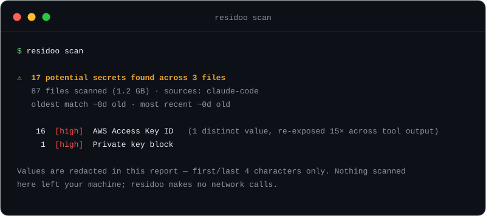

<div align="center">

<picture>
  <source media="(prefers-color-scheme: dark)" srcset="docs/logo-dark.svg">
  <source media="(prefers-color-scheme: light)" srcset="docs/logo-light.svg">
  
</picture>

**Find secrets leaking through your AI coding agent's session history.**

[](https://www.npmjs.com/package/residoo)
[](https://github.com/dandovdub/residoo/actions/workflows/ci.yml)
[](https://scorecard.dev/viewer/?uri=github.com/dandovdub/residoo)
[](LICENSE)
[](package.json)
[](package.json)



</div>

Every time Claude Code, Cursor, or a similar tool reads a file, runs a
command, or browses a page for you, it writes the whole session to disk,
including whatever it touched. A `.env` file, a config with a real key, a
login token captured during testing: that credential is now sitting in
plaintext, indefinitely, somewhere almost nobody thinks to check.

residoo scans those transcripts and tells you what's in them.

```
$ residoo scan

⚠  17 potential secrets found across 3 files
   87 files scanned (1.2 GB) · sources: claude-code
   oldest match ~8d old · most recent ~0d old

    16  [high]  AWS Access Key ID   (1 distinct value, re-exposed 15× across tool output)
     1  [high]  Private key block

Values are redacted in this report (first/last 4 characters only). Nothing
scanned here left your machine; residoo makes no network calls.
```

That's one snapshot. `residoo watch` runs the same engine continuously and
alerts the moment a new secret lands, instead of waiting for you to
remember to scan again. `residoo mcp` lets Claude Code query findings
conversationally. `residoo cred` removes the reason a credential gets
pasted into chat in the first place: store it once in your OS keychain,
run a command with it injected as an environment variable, never typed
into the conversation at all — which also means a long session compacting
away the exact value you pasted days ago can't force you to paste it
again, since there's nothing to lose. `residoo guard` blocks an obviously
sensitive file read before it happens (100% recall, 0% false positives on
its own [scored 81-case corpus](bench/guard/RESULTS.md)). All four are
covered in [docs/features.md](docs/features.md).

> [!NOTE]
> gitleaks and trufflehog scan **commits**. residoo scans the **conversation
> transcripts** an AI agent leaves behind: a different, previously
> uncovered surface. Full comparison, including agentsweep and
> trufflehog/betterleaks' verification postures, in
> [docs/comparison.md](docs/comparison.md).

## Benchmark: measured, not claimed

Scored #1 of 8 real competing tools on a reproducible, synthetic-but-
pattern-true corpus, with live egress monitoring so "no network calls" is
observed, not just documented. All 8, not just the closest one:

| tool | distinct credentials found | precision | egress during the scan |
|---|---|---|---|
| **residoo** | **45/45 (100%)** | **100%** | **none-observed** |
| agentsweep | 33/42 (79%) | 100% | none-observed |
| gitleaks | 32/45 (71%) | 100% | none-observed |
| betterleaks | 32/45 (71%) | 100% | none-observed |
| whatileaked | 28/42 (67%) | 100% | none-observed |
| kingfisher | 29/45 (64%) | 100% | attempts calls in default mode |
| trufflehog | 29/45 (64%) | 97% | attempts calls in default mode |
| detect-secrets | 25/45 (56%) | 2% | attempts calls in default mode |

"none-observed" is a measured result, not a default assumption: every run
sits under a live proxy trap and process-tree polling, and a deliberate
canary connection is fired and confirmed caught *before* each real
benchmark run, specifically so a clean result is falsifiable evidence, not
silence. The 3 rows with real outbound calls prove the monitor was
watching them too — kingfisher, trufflehog, and detect-secrets each ship
an *optional* live-verification feature (checking a found secret against
the vendor's own API), scored here in their documented offline mode for a
fair recall comparison, with their default mode's real connection
attempts reported factually rather than hidden.

GitGuardian's `ggshield` is documented, not scored: it refuses to run
without a server account, so there's no local result to measure. Published
while losing rows, then fixed in public against the classes it was losing
— full methodology, every dated rerun, and how to reproduce it yourself:
[docs/benchmark.md](docs/benchmark.md).

## What it does

- Scans your local AI-agent session transcripts for 79 high-confidence
  secret patterns: cloud provider keys, private key blocks, OAuth/API
  tokens, database connection strings, and more. See
  [`src/patterns.js`](src/patterns.js).
- Sees through two transcript-specific disguises: a credential dumped only
  as base64 on a line, or split across two adjacent streaming records, is
  decoded/rejoined and rescanned. See [`src/decode.js`](src/decode.js).
- Pairs an AWS secret access key with a nearby confirmed access key id
  (also PlanetScale and MongoDB Atlas Service Account credentials) and
  reports both at high confidence; ambiguous pairings are reported as
  nothing rather than a guess. See [`src/pairing.js`](src/pairing.js).
- Decodes a JWT's own `exp` claim locally and reports "valid until" or
  "expired" instead of just "last seen."
- **`--verify`** (opt-in, makes a real network call): asks a credential's
  own vendor whether it still authenticates. 35 vendors today, off by
  default. See [docs/architecture.md](docs/architecture.md#verifying-credentials-are-still-live).
- Redacts everything in its own output, including `--json`: you get a
  shape and a first/last-4 preview, never the real value.
- `--sarif` emits SARIF 2.1.0 for GitHub code scanning.
- `--html [path]` writes a self-contained, filterable HTML report with a
  rotation guide per finding — same redaction guarantee as every other
  output, no external CSS/JS, nothing to open it needs the network.
- `--seal --keychain` encrypts every transcript with a finding into a
  local vault. See [docs/architecture.md](docs/architecture.md#sealing-what-it-finds).
- `--ocr` reads secrets out of a pasted or tool-returned screenshot, too —
  a real, verified-unclaimed gap: nobody else in this space has shipped
  this. Opt-in, needs `tesseract` installed, 100% local, best-effort (OCR
  can misread a character and miss an exact-format match). See
  [docs/architecture.md](docs/architecture.md#reading-secrets-out-of-pasted-screenshots).
- Tells you how many **distinct** secrets it found versus how many times
  one got echoed back across tool calls, so the headline number reflects
  real exposure, not repetition.
- Also scans agent **config files** and checks for **planted persistence**
  (hooks, droppers, invisible Unicode) — a different, better-documented
  leak surface. See [docs/architecture.md](docs/architecture.md#beyond-transcripts-configs-and-planted-persistence).
- Attaches a **rotation runbook** to every finding, plus a local
  acknowledgement ledger. See [docs/architecture.md](docs/architecture.md#rotation-from-found-to-closed).
- `--project <dir>` scans a repository checkout instead of the machine,
  for CI and pre-commit. See [docs/ci.md](docs/ci.md).
- `residoo watch` / `residoo mcp` / `residoo cred` / `residoo guard`:
  continuous scanning, conversational queries, credential injection
  without pasting, and pre-read blocking. See [docs/features.md](docs/features.md).

## What it does not do

> [!IMPORTANT]
> **No network calls in the default path, and none at all unless you pass
> `--upload-cloudroam` or `--verify`.** A secret scanner that phones home
> is not a tool you should trust with your secrets. Every network-capable
> call in the codebase lives behind one of those two flags: verify it
> yourself in [`src/sealvault.js`](src/sealvault.js) and
> [`src/verify.js`](src/verify.js).

- **Nothing destructive, ever.** Scanning is read-only. Sealing creates
  *new* files and modifies or deletes nothing, not even the plaintext it
  just encrypted a copy of.
- **No telemetry, no analytics, no update-check ping.**

Shape-based detection also can't tell a real secret from a realistic-
looking example in a fetched web page. Three suppression layers narrow the
gap, none catches every case, and all are re-includable with
`--include-suppressed`. Treat every finding as a lead to check, not a
certainty — true of every tool in this category, including the well-
established ones.

## Install

```bash
npx residoo scan
```

or install it properly:

```bash
npm install -g residoo
residoo scan
```

```bash
brew tap dandovdub/residoo
brew install residoo
```

The Homebrew formula installs the exact tarball published to npm (sha256
verified): same bits, not a second build.

Requires Node.js 18+ (22.5+ for the SQLite-backed sources listed in
[docs/sources.md](docs/sources.md); residoo still runs fine without it).
Zero runtime dependencies: check `package.json` rather than take that on
faith.

## Usage

```
residoo scan [options]

  --json                  machine-readable output (full detail, still redacted)
  --html [path]           also write a self-contained HTML report (default:
                          residoo-report-<stamp>.html); combines with --json
  --project [dir]         scan a repository checkout instead of this machine
                          (committed transcripts, agent configs, root .env)
  --include-noisy         also run broad, false-positive-prone rules
  --include-suppressed    also show matches that looked like placeholder/example text
  --fail-on-find          exit code 1 if anything is found (for CI): secret
                          findings and integrity warnings count, review items don't
  --allow-acked           with --fail-on-find: acknowledged findings no longer
                          fail the run (pending ones and warnings still do)
  --no-integrity          skip the integrity checks
  --no-color              disable ANSI colour
  --verify                ask each credential's own vendor if it still authenticates
                          (real network call; see docs/architecture.md)
  --ocr                   also OCR pasted/tool-returned images and scan the text
                          (needs tesseract installed; no network call; best-effort)

  --seal                  encrypt every transcript with findings into a local vault
  --vault-dir <dir>       vault location (default ./residoo-vault-<stamp>)
  --upload-cloudroam      also upload the sealed vault (needs CLOUDROAM_API_KEY,
                          --connector <id>, --bucket <name>; ciphertext only)

residoo explain <rule-id>                           full rotation runbook for one rule
residoo explain --list                              every rule id and label
residoo ack <fingerprint> [--note <text>]           mark one finding rotated

residoo unseal <vault-dir>                          list a vault's contents
residoo unseal <vault-dir> --restore <n> --out <p>  restore one file, hash-verified

residoo watch / mcp / cred / guard                  see docs/features.md
```

The vault passphrase comes from `RESIDOO_PASSPHRASE` or a hidden interactive
prompt. There is no recovery if you lose it, so pick one you keep.

## Sources supported today

44 sources, real-install-verified for Claude Code and its config family,
multi-source-corroborated for the rest (Cursor, Codex CLI, Cline, Windsurf,
Gemini CLI, Copilot, and 30+ more). Full list, what "corroborated" means,
and how to add one: [docs/sources.md](docs/sources.md).

## License

MIT. See `LICENSE`.

---

Built and maintained by the team behind [CloudRoam](https://cloudroam.io),
client-side encrypted, cross-cloud backup. residoo has no dependency on
CloudRoam and never will need one to be useful. If a scan turns up something
you want stored somewhere durable and encrypted going forward, that's the
kind of problem CloudRoam solves, but it's an entirely separate choice from
running this tool.
